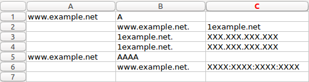

# pcapng-dns-parser
Il s'agit d'un petit script python2 pouvant parser un fichier .pcap/.pcapng, en extraire les réponses DNS et les formater dans un fichier .csv afin de pouvoir facilement les visualiser.
Il est basé sur le package python2 [scapy](http://scapy.readthedocs.io/en/latest/introduction.html).

## Requirements
Afin de pouvoir rapidement mettre ce script en oeuvre, un fichier `requirements.txt` est fourni. Il est possible d'utiliser l'utilitaire `pip` de python de la manière suivante:
```python
pip install -r requirements.txt
```
> NB: Il est vivement conseillé, mais pas obligatoire, d'utiliser `virtualenv` lors de l'installation des dépendances.

>[virtualenv](https://virtualenv.pypa.io/en/stable/) est un utilitaire de python permettant de créer des environnements virtuels. Cela permet d'avoir une configuration spécifique à chaque projet python sans "polluer" l'installation principale de python avec des packages supplémentaires. Voici une petite explication sur la création d'un nouvel environnement virtuel sous Linux:

    sudo apt-get install virtualenv #installation de virtualenv

    virtualenv nom/de/l/environnement/virtuel #création de l'environnement

    source nom/de/l/environnement/virtuel/bin/activate #activation de l'environnement virtuel

    ... #action sous l'environnement virtuel (installation de package via pip etc)

    deactivate #fermeture de l'environnement virtuel


## Usage
Voici un exemple d'usage du script:
```python
python pcapng-dns-parser.py test.pcapng test.csv
```

Le premier argument est le fichier .pcap/.pcapng à parser et le second le chemin vers le fichier de sortie.

Le fichier de sortie sera semblable à ceci:
```text
www.example.net,A,,
,www.example.net.,1example.net
,1example.net.,XXX.XXX.XXX.XXX
,1example.net.,XXX.XXX.XXX.XXX
www.example.net,AAAA,,
,www.example.net.,XXXX:XXXX:XXXX:XXXX
```

Visualisation sous [Gnumeric](http://www.gnumeric.org/):



La première ligne reprend le nom de domaine contenu dans la requête DNS associée à la réponse ainsi que le type de requête.
Les lignes suivantes contiennent les adresses IP ainsi que les éventuels alias.

Des informations utiles sont également affichées dans le terminal dans lequel le script est lancé. On y retrouve, entre autres, le nombre total de paquets trouvés dans le fichier de capture ansi que le nombre total de réponses DNS lues et écrites dans le fichier de sortie.

> /!\ Le nombre total de réponses DNS peut varier par rapport à celui repris dans le fichier de capture ! En effet, seules les requêtes ayant abouti sont reprises.

> NB: Cette version du script est suffisante pour la première étape du projet, mais une petite adaptation à venir est nécessaire pour la seconde étape.
